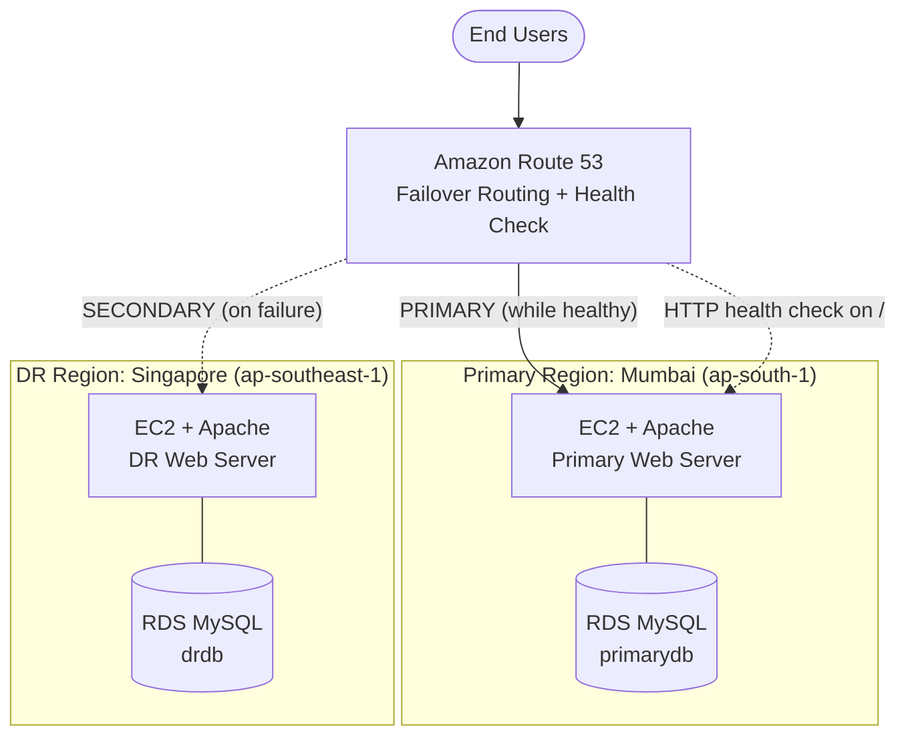
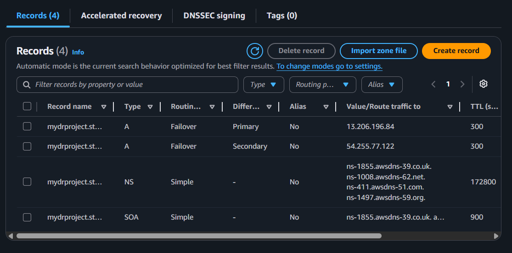
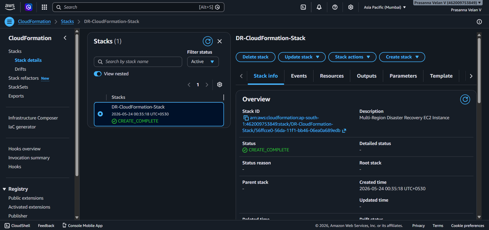
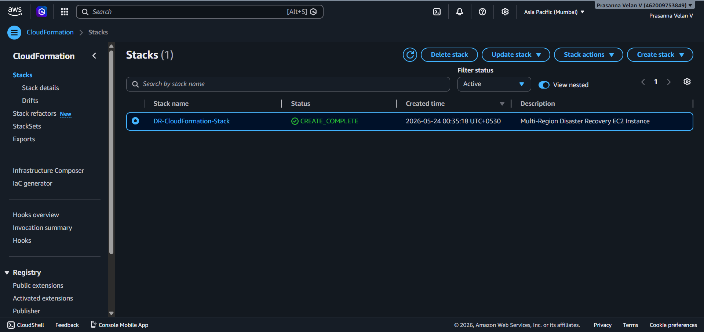

# Multi-Region Disaster Recovery on AWS with Automated Route 53 Failover


> An active-passive disaster recovery setup across two AWS regions. **Mumbai (`ap-south-1`)** serves traffic. **Singapore (`ap-southeast-1`)** takes over automatically when Route 53 health checks detect that the primary is down.

---

## Table of Contents
1. [Project Overview](#project-overview)
2. [Architecture](#architecture)
3. [Tech Stack](#tech-stack)
4. [How Failover Works](#how-failover-works)
5. [Implementation Steps](#implementation-steps)
6. [Failover Test and Results](#failover-test-and-results)
7. [Troubleshooting](#troubleshooting)
8. [Limitations and Future Improvements](#limitations-and-future-improvements)
9. [Key Learnings](#key-learnings)
10. [Repository Structure](#repository-structure)
11. [Author](#author)

---

## Project Overview

If a single server or an entire AWS region fails, an application with no recovery plan goes offline. This project shows how to avoid that with a **multi-region, active-passive disaster recovery (DR) architecture**.

- Application servers (EC2) and databases (RDS MySQL) are deployed in **two regions**.
- **Amazon Route 53** health checks continuously monitor the primary (Mumbai) endpoint.
- If the primary stops responding, Route 53 **automatically updates DNS** so users are sent to the DR (Singapore) endpoint, with no manual action.
- **AWS CloudFormation** is used to provision infrastructure as code.

### What this project demonstrates
| Skill | Evidence in this repo |
|---|---|
| High availability and DR planning | Active-passive design across two regions |
| DNS-based failover | Route 53 failover routing with health check |
| Multi-region deployment | EC2 and RDS in Mumbai and Singapore |
| Infrastructure as Code | CloudFormation YAML template and deployed stack |
| Testing and validation | Simulated outage by stopping Apache, with captured results |

---

## Architecture


A simplified view of the same design:



### Design choices
- **Active-passive:** the DR region stays on standby and only receives traffic when the primary fails, which keeps cost low.
- **Mumbai as primary, Singapore as DR:** two geographically separate regions, so a regional outage does not affect both.
- **DNS-level failover:** Route 53 handles detection and redirection without extra application logic.

---

## Tech Stack

| Category | Service / Tool | Purpose |
|---|---|---|
| Compute | Amazon EC2 (Amazon Linux, `t3.micro`) | Hosts the Apache web server in each region |
| Database | Amazon RDS for MySQL (`db.t3.micro`) | `primarydb` in Mumbai, `drdb` in Singapore |
| DNS and failover | Amazon Route 53 | Hosted zone, failover A records, health check |
| IaC | AWS CloudFormation (YAML) | Automated EC2 provisioning |
| Web server | Apache HTTPD | Serves a region-identifying test page |
| Security | Security Groups | Allow SSH (22) and HTTP (80) |

---

## How Failover Works

1. A **public hosted zone** in Route 53 manages the domain.
2. Two **A records** share the same name but use the **Failover** routing policy:
   - **Primary** → Mumbai EC2 public IP, with a **health check attached**
   - **Secondary** → Singapore EC2 public IP
3. The **health check** sends HTTP requests to the Mumbai server on path `/`.
4. While the check is **Healthy**, DNS answers point to Mumbai.
5. When the check turns **Unhealthy**, Route 53 begins answering with the Singapore record instead.

> ⏱️ **Failover time** depends on the health check interval, the failure threshold, and the DNS record TTL (300 seconds on these records). Clients may keep using cached DNS answers until the TTL expires.

---

## Implementation Steps

<details>
<summary><b>Step 1: Launch the primary EC2 instance (Mumbai)</b></summary>

<br>

- Region: `ap-south-1`, Amazon Linux AMI
- Security group: allow SSH and HTTP
- Install Apache and create a test page showing `PRIMARY REGION - MUMBAI`

```bash
sudo yum update -y
sudo yum install httpd -y
sudo systemctl start httpd
sudo systemctl enable httpd
echo "<h1>PRIMARY REGION - MUMBAI</h1>" | sudo tee /var/www/html/index.html
```


</details>

<details>
<summary><b>Step 2: Launch the DR EC2 instance (Singapore)</b></summary>

<br>

- Region: `ap-southeast-1`, same setup as the primary
- Test page shows `DISASTER RECOVERY REGION - SINGAPORE`

```bash
echo "<h1>DISASTER RECOVERY REGION - SINGAPORE</h1>" | sudo tee /var/www/html/index.html
```


</details>

<details>
<summary><b>Step 3: Create the RDS MySQL database in Mumbai</b></summary>

<br>

- Engine: MySQL, Free Tier template, `db.t3.micro`, identifier `primarydb`


</details>

<details>
<summary><b>Step 4: Create the RDS MySQL database in Singapore</b></summary>

<br>

- Same engine and size, identifier `drdb`, used as the DR database


</details>

<details>
<summary><b>Step 5: Create the Route 53 hosted zone</b></summary>

<br>

- Create a public hosted zone for the project domain


</details>

<details>
<summary><b>Step 6: Configure Route 53 failover records</b></summary>

<br>

- **Primary** A record → Mumbai EC2 public IP (health check attached)
- **Secondary** A record → Singapore EC2 public IP
- Routing policy: **Failover**, TTL: 300



</details>

<details>
<summary><b>Step 7: Configure the Route 53 health check</b></summary>

<br>

- Protocol: HTTP, path: `/`, endpoint: Mumbai EC2 public IP
- Verified the status shows **Healthy** while Apache is running


</details>

<details>
<summary><b>Step 8 and 9: Create and deploy the CloudFormation stack</b></summary>

<br>

- Wrote a YAML template defining the EC2 instance properties
- Deployed it as stack `DR-CloudFormation-Stack` in Mumbai
- Stack status: **CREATE_COMPLETE**

📄 Template: [`dr-template.yaml`](dr-template.yaml)





</details>

---

## Failover Test and Results

**Test procedure**
1. Opened the application through the Route 53 domain → served by **Mumbai** (`PRIMARY REGION - MUMBAI`).
2. Stopped Apache on the Mumbai instance to simulate an outage:
   ```bash
   sudo systemctl stop httpd
   ```
3. Watched the Route 53 health check change from **Healthy → Unhealthy**.
4. Reloaded the domain → traffic was now served by **Singapore** (`DISASTER RECOVERY REGION - SINGAPORE`).

| Stage | Health check | Page served |
|---|---|---|
| Normal operation | ✅ Healthy | PRIMARY REGION - MUMBAI |
| Apache stopped on primary | ❌ Unhealthy | DISASTER RECOVERY REGION - SINGAPORE |

**Simulating the outage**


**Health check status**


---

## Troubleshooting

| Issue | Likely cause | Fix |
|---|---|---|
| Health check shows **Unhealthy** unexpectedly | Apache stopped, or port 80 blocked | Check `systemctl status httpd`; allow HTTP (80) in the security group; confirm the public IP in the record |
| Failover does not happen | Records misconfigured | Both records must share the same name; routing policy must be **Failover**; attach the health check **only to the Primary** record |

---

## Limitations and Future Improvements

This is a learning-focused implementation. Here is what I would add for a production setup:

- [ ] **Cross-region database replication.** Currently `primarydb` and `drdb` are separate MySQL instances. Next step: an RDS cross-region read replica, with promotion to primary during failover.
- [ ] **Elastic IPs or an Application Load Balancer.** Route 53 records currently point to EC2 public IPs, which change if an instance is stopped and started.
- [ ] **Extend CloudFormation** to cover RDS, security groups and Route 53 records, and deploy the same template in both regions.
- [ ] **Alerting.** Create a CloudWatch alarm on the health check and notify through SNS when failover occurs.
- [ ] **Lower DNS TTL** and tune health check interval and failure threshold to reduce failover time.
- [ ] **HTTPS health checks** and a deeper `/health` endpoint that also verifies database connectivity.
- [ ] **Define and measure RTO and RPO** targets, with documented failback steps.

---

## Key Learnings

- Difference between **high availability** (surviving a server failure) and **disaster recovery** (surviving a region failure).
- How Route 53 **failover routing**, **health checks** and **TTL** interact to determine failover speed.
- Why **active-passive** is a cost-effective DR pattern and how it differs from active-active.
- Writing and deploying **CloudFormation** templates, and reading stack status and events.
- Troubleshooting health checks: security groups, service status and record configuration.

---

## Repository Structure

```
.
├── README.md
├── Architecture Diagram Multi-Region Disaster Recovery Plan.png
├── Multi-Region Disaster Recovery Plan.pdf
├── dr-template.yaml
└── Screenshot/
    ├── Primary Server- Instances.png
    ├── Apache http server.png
    ├── Records.png
    ├── Health Check.png
    └── ...
```

---

## Author

**Prasanna Velan V**: Entry-Level AWS Cloud and DevOps Engineer

📍 Bengaluru, India  |  📧 prasannavelan2003@gmail.com

[LinkedIn](https://www.linkedin.com/in/prasanna-velan-v) · [Portfolio](https://prasannavelanv.netlify.app/) · [Credly Badges](https://www.credly.com/users/prasanna_velan_v) · [GitHub](https://github.com/PrasannaVelanV)

⭐ If you found this project useful, feel free to star the repository.
